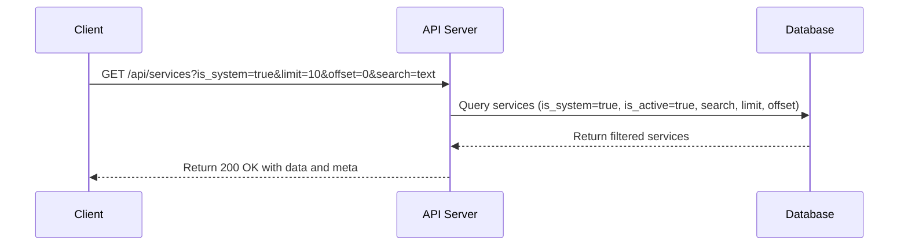
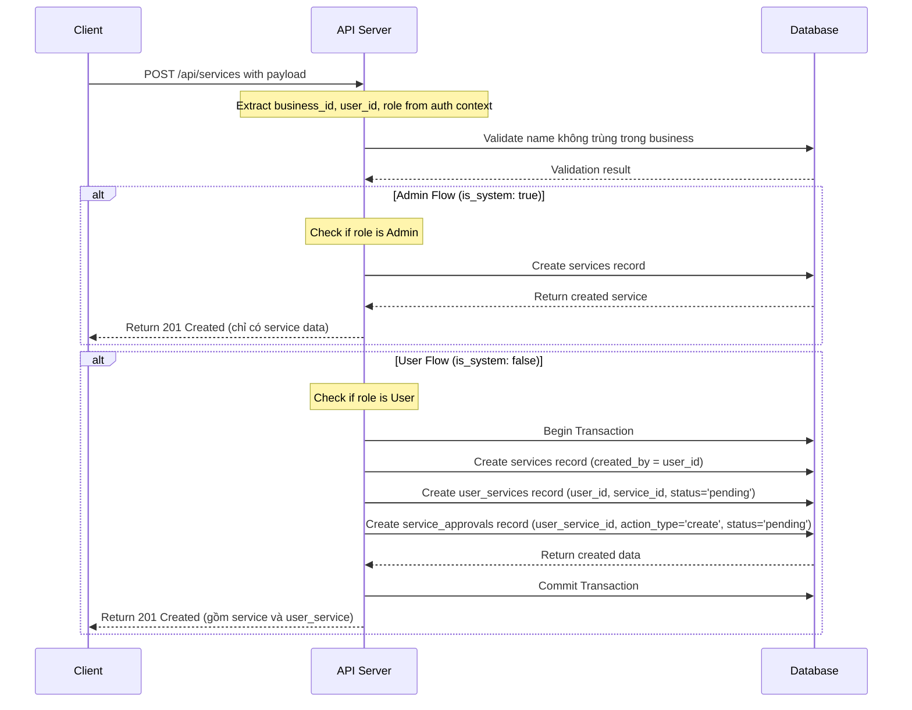
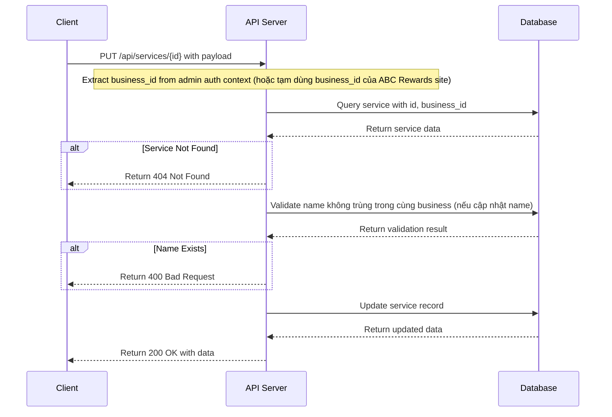
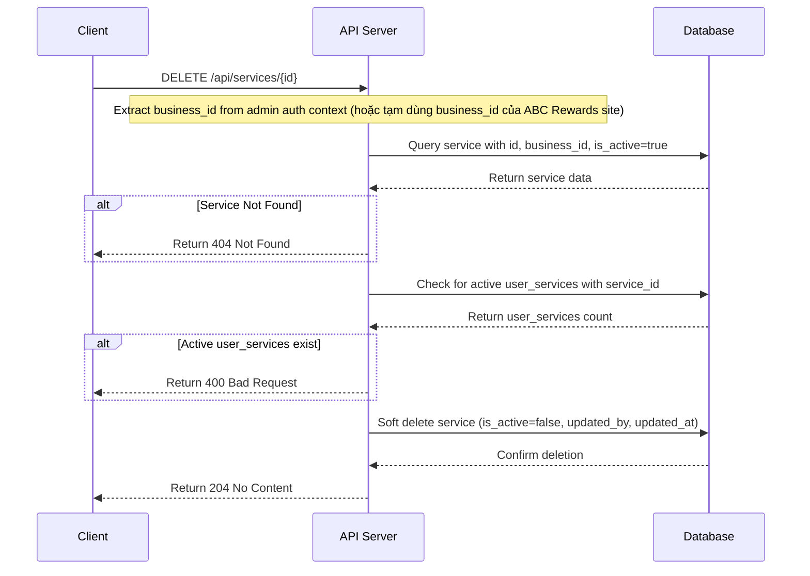
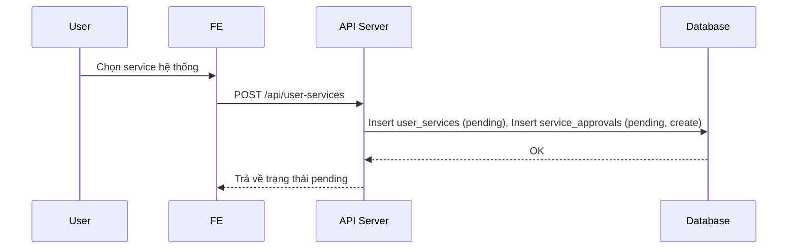
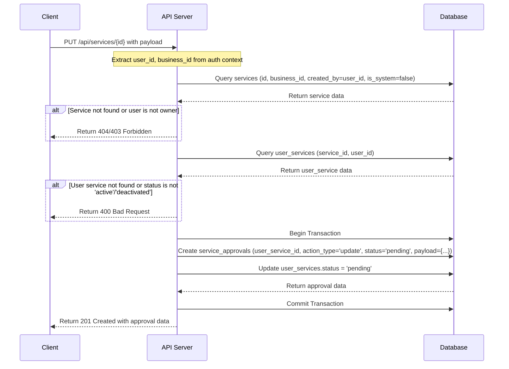
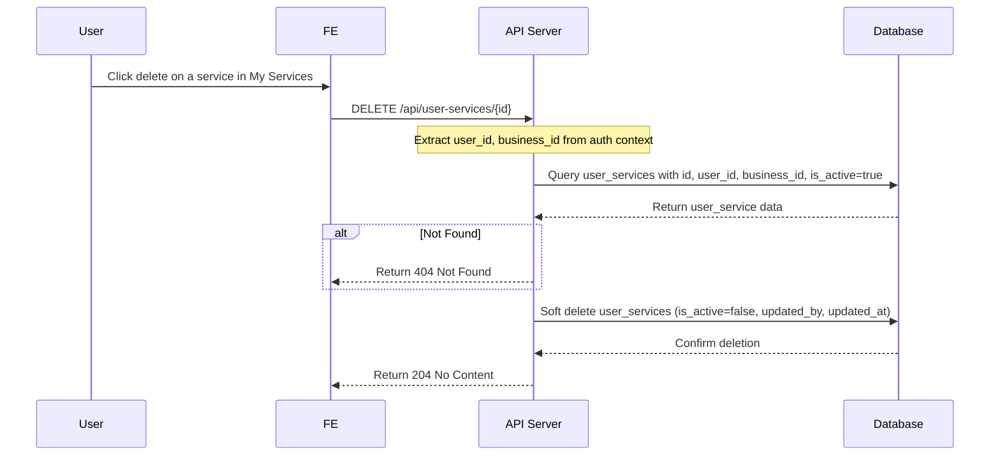

# 🧩 Module: Service Management – Low-Level Design (LLD)

## 1. Mục tiêu

- Cho phép End User đăng ký, kích hoạt/deactive các dịch vụ (service) mặc định của hệ thống hoặc tự tạo.
- Quản lý quy trình duyệt (approve/reject) service do user tạo hoặc update.
- Admin có thể CRUD service hệ thống (is_system=true) và duyệt các yêu cầu tạo/cập nhật service của user.
- Lưu vết lịch sử duyệt, trạng thái từng lần đăng ký/cập nhật service.
- Hỗ trợ multi-business (business_id).

---

## 2. Entities

### services

- `id` (uuid, PK): ID dịch vụ
- `business_id` (uuid, FK): Service thuộc business nào
- `name` (string): Tên dịch vụ
- `description` (string): Mô tả dịch vụ
- `points` (decimal): Số điểm khi thực hiện dịch vụ
- `image_url` (string): Ảnh dịch vụ
- `is_system` (boolean): true: service hệ thống (admin tạo), false: user tạo
- `created_by` (uuid): Ai tạo service này (admin/user)
- `updated_by` (uuid)
- `created_at` (timestamp)
- `updated_at` (timestamp)
- `is_active` (boolean)

### user_services

- `id` (uuid, PK): ID
- `user_id` (uuid): Ai sở hữu/đăng ký service này
- `service_id` (uuid): FK đến services
- `status` (enum): pending, active, deactivated, rejected
- `created_by` (uuid)
- `updated_by` (uuid)
- `created_at` (timestamp)
- `updated_at` (timestamp)
- `is_active` (boolean)

### service_approvals

- `id` (uuid, PK): ID
- `user_service_id` (uuid): FK đến user_services
- `status` (enum): pending, approved, rejected
- `comment` (string): Lý do duyệt/từ chối
- `action_type` (enum): create, update
- `payload` (jsonb, nullable): Lưu trữ data khi user yêu cầu update
- `created_by` (uuid)
- `updated_by` (uuid)
- `created_at` (timestamp)
- `updated_at` (timestamp)
- `is_active` (boolean)

---

## 2.1 Database diagram

```mermaid
erDiagram
  businesses {
    uuid id PK
    ...
  }
  users {
    uuid id PK
    ...
  }
  services {
    uuid id PK
    uuid business_id FK
    string name
    string description
    decimal points
    string image_url
    boolean is_system
    uuid created_by
    uuid updated_by
    timestamp created_at
    timestamp updated_at
    boolean is_active
  }
  user_services {
    uuid id PK
    uuid user_id FK
    uuid service_id FK
    enum status
    uuid created_by
    uuid updated_by
    timestamp created_at
    timestamp updated_at
    boolean is_active
  }
  service_approvals {
    uuid id PK
    uuid user_service_id FK
    enum status
    string comment
    enum action_type
    jsonb payload
    uuid created_by
    uuid updated_by
    timestamp created_at
    timestamp updated_at
    boolean is_active
  }
  businesses ||--o{ services : "owns"
  users ||--o{ user_services : "has"
  services ||--o{ user_services : "has"
  user_services ||--o{ service_approvals : "has"
```

---

## 3. Use Cases & API Design

### 3.1 Lấy danh sách service hệ thống (Admin/End User)

```shell
GET /api/services?is_system=true&limit=10&offset=0&search=text
```

**Params:**

- `is_system` (boolean, required): true để lấy service hệ thống
- `limit` (integer, optional): số lượng record trả về (default: 10)
- `offset` (integer, optional): vị trí bắt đầu (default: 0)
- `search` (string, optional): tìm kiếm theo tên/mô tả service (case-insensitive)

**Response:**

```json
{
  "data": [
    {
      "id": "uuid",
      "business_id": "uuid",
      "name": "Featherlight Assistance",
      "description": "Easy support",
      "points": 1.0,
      "image_url": "...",
      "is_system": true,
      "is_active": true
    }
  ],
  "meta": {
    "count": 1,
    "limit": 10,
    "offset": 0,
    "search": ""
  }
}
```

**Sequence diagram:**



**Logic:**

- Extract user from request và lấy `business_id` từ auth context (hoặc tạm dùng `business_id` của ABC Rewards site - đối với admin).
- Query `services` với `business_id`, `is_system=true`, `is_active=true`, `search`, `limit`, `offset`.
- Nếu có `search`, tìm kiếm case-insensitive trên `name` hoặc `description`.
- Phân trang với `limit` và `offset`.
- Trả về `data` (danh sách service) và `meta` (tổng số record, limit, offset, search).

---

### 3.2 Tạo service (Admin/User)

```shell
POST /api/services
```

**Payload:**

```json
{
  "name": "Service Name",
  "description": "Service description",
  "points": 5.0,
  "image_url": "...",
  "is_system": false
}
```

**Response (Success):**

```json
{
  "data": {
    "id": "uuid",
    "business_id": "uuid",
    "name": "Service Name",
    "description": "Service description",
    "points": 5.0,
    "image_url": "...",
    "is_system": false,
    "is_active": true,
    "created_at": "...",
    "user_service": {
      "id": "uuid",
      "status": "pending"
    }
  }
}
```

**Sequence Diagram:**



**Logic:**

- Extract `business_id`, `user_id`, và `role` từ auth context.
- Validate `name` không được trùng trong cùng `business_id`.
- **Admin Flow:**
  - Nếu `role` là Admin và `is_system: true` trong payload, chỉ tạo record trong `services`.
  - `created_by` là `admin_id`.
- **User Flow:**
  - Nếu `role` là User và `is_system: false` trong payload:
  - Start transaction.
  - Tạo record trong `services` với `is_system: false`, `created_by = user_id`.
  - Dùng `service_id` vừa tạo, tạo record trong `user_services` với `status: 'pending'`.
  - Dùng `user_service_id` vừa tạo, tạo record trong `service_approvals` với `action_type: 'create'`, `status: 'pending'`.
  - Commit transaction.
- Trả về dữ liệu tương ứng.

---

### 3.3 Cập nhật service hệ thống (Admin)

```shell
PUT /api/services/{id}
```

**Payload:**

```json
{
  "name": "Featherlight Assistance Updated",
  "description": "Updated description",
  "points": 2.5,
  "image_url": "...",
  "is_active": true
}
```

**Response:**

```json
{
  "data": {
    "id": "uuid",
    "name": "Featherlight Assistance Updated",
    "description": "Updated description",
    "points": 2.5,
    "image_url": "...",
    "is_active": true,
    "created_at": "2025-05-02T16:14:00.000Z",
    "updated_at": "2025-05-02T16:15:00.000Z"
  }
}
```

**Sequence diagram:**



**Logic:**

- Extract `business_id` từ auth context (tạm dùng business_id của ABC Rewards site).
- Kiểm tra service tồn tại với id, business_id.
- Chỉ admin được phép cập nhật.
- Update các trường được gửi lên.
- Trả về toàn bộ object service đã cập nhật.

---

### 3.4 Xóa service hệ thống (Admin)

```shell
DELETE /api/services/{id}
```

**Response:**

```json
{
  "data": {
    "id": "uuid"
  }
}
```

**Sequence diagram:**



**Logic:**

- Extract `business_id` từ auth context (tạm dùng business_id của ABC Rewards site).
- Kiểm tra service tồn tại với id, business_id, is_active=true.
- Kiểm tra không có user_services active liên quan.
- Soft delete: set is_active=false, updated_by, updated_at cho service.
- Trả 204 No Content.

---

### 3.5 User đăng ký service hệ thống

```shell
POST /api/user-services
```

**Payload:**

```json
{
  "service_id": "uuid"
}
```

**Response:**

```json
{
  "data": {
    "id": "uuid",
    "user_id": "user_id",
    "service_id": "uuid",
    "status": "pending",
    "created_at": "2025-05-02T16:14:00.000Z"
  }
}
```

**Sequence diagram:**



**Logic:**

- Extract `business_id` từ service_id (truy vấn bảng services) hoặc từ auth context.
- Tạo user_services (status=pending), tạo service_approvals (pending, action_type=create).

---

### 3.6 User cập nhật service của mình

```shell
PUT /api/services/{id}
```

**Payload:**

```json
{
  "name": "Dạy tiếng Anh nâng cao",
  "description": "1 buổi dạy nâng cao",
  "points": 3.5,
  "image_url": "..."
}
```

**Response (Success):**

```json
{
  "data": {
    "id": "uuid",
    "user_service_id": "uuid",
    "status": "pending",
    "action_type": "update"
  }
}
```

**Sequence Diagram:**



**Logic:**

- Extract `user_id`, `business_id` từ auth context.
- Validate service `{id}` tồn tại, thuộc `business_id`, là service custom (`is_system: false`), và do chính user này tạo (`created_by = user_id`).
- Tìm `user_services` tương ứng với `service_id` và `user_id`. Service phải đang ở trạng thái `active` hoặc `deactivated` mới được update.
- Start transaction.
- **Không cập nhật bảng `services` ngay.**
- Tạo một record mới trong `service_approvals` với:
  - `user_service_id` tìm được ở trên.
  - `action_type: 'update'`.
  - `status: 'pending'`.
  - `payload`: chứa toàn bộ payload của request.
- Cập nhật `status` của `user_services` thành `pending`.
- Commit transaction.
- Trả về thông tin của `service_approvals` vừa tạo.

---

### 3.7 User xóa service đã đăng ký

```shell
DELETE /api/user-services/{id}
```

**Params:**

- `{id}`: ID của bản ghi user_services (không phải id của services)

**Response:**

```json
{
  "data": {
    "id": "uuid"
  }
}
```

**Sequence diagram:**



**Logic:**

- Extract `user_id`, `business_id` từ auth context.
- Kiểm tra user_services tồn tại với id, user_id, business_id, is_active=true.
- Soft delete: set is_active=false, updated_by, updated_at cho user_services.
- Trả 204 No Content.

---

### 3.8 User active/deactive service đã được duyệt

```shell
PATCH /api/user-services/{id}/status
```

**Payload:**

```json
{
  "status": "active"
}
```

**Response:**

```json
{
  "data": {
    "id": "uuid",
    "user_id": "uuid",
    "service_id": "uuid",
    "status": "active",
    "created_at": "...",
    "updated_at": "..."
  }
}
```

**Logic:**

- **Extract `business_id` từ user_service.service_id (truy vấn bảng services) hoặc từ auth context.**
- Chỉ cho phép khi user_services.status=`active` hoặc `deactivated`.
- Trả về toàn bộ object user_service đã cập nhật.

---

### 3.9 Admin duyệt yêu cầu (approve/reject)

```shell
GET /api/service-approvals?status=pending&limit=10&offset=0
```

```shell
PUT /api/service-approvals/{id}
```

**Payload:**

```json
{
  "status": "approved",
  "comment": "OK"
}
```

**Response:**

```json
{
  "data": {
    "id": "uuid",
    "status": "approved"
  }
}
```

**Logic:**

- Extract `business_id` từ user_service.service_id (truy vấn bảng services) hoặc từ auth context.
- **GET:** Trả về danh sách yêu cầu chờ duyệt (`status: 'pending'`), phân trang.
- **PUT:**
  - Tìm `service_approvals` bằng `{id}`. Validate nó thuộc `business_id`.
  - Start transaction.
  - Cập nhật `service_approvals` (status, comment, approver_id).
  - Dựa vào `action_type` trong `service_approvals`:
    - **Nếu `action_type: 'create'`:**
      - Nếu `status: 'approved'`, cập nhật `user_services.status = 'active'`.
      - Nếu `status: 'rejected'`, cập nhật `user_services.status = 'rejected'`.
    - **Nếu `action_type: 'update'`:**
      - Nếu `status: 'approved'`:
        - Lấy dữ liệu từ `service_approvals.payload`.
        - Cập nhật record trong bảng `services` tương ứng.
        - Cập nhật `user_services.status = 'active'`.
      - Nếu `status: 'rejected'`, chỉ cần cập nhật `user_services.status = 'active'` (trả lại trạng thái cũ trước khi yêu cầu update).
  - Commit transaction.
  - Trả về `service_approvals` đã cập nhật.

---

### 3.10 Lấy chi tiết một service

```shell
GET /api/services/{id}
```

**Response:**

```json
{
  "data": {
    "id": "uuid",
    "business_id": "uuid",
    "name": "...",
    "description": "...",
    "points": 2.0,
    "image_url": "...",
    "is_system": false,
    "is_active": true
  }
}
```

**Logic:**

- Extract `business_id` từ auth context.
- Validate service thuộc business_id này.
- Trả về chi tiết service.

---

### 3.11 Lấy chi tiết một user_service

```shell
GET /api/user-services/{id}
```

**Response:**

```json
{
  "data": {
    "id": "uuid",
    "user_id": "uuid",
    "service_id": "uuid",
    "status": "active",
    "created_at": "..."
  }
}
```

**Logic:**

- Extract `business_id` từ user_service.service_id (truy vấn bảng services) hoặc từ auth context.
- Trả về chi tiết user_service theo business.

---

## 4. Logic tổng quát

- Phân biệt service hệ thống và user tạo: is_system (true/false).
- Quy trình duyệt: Tất cả yêu cầu tạo/cập nhật đều qua bảng service_approvals, trace được lịch sử duyệt.
- Trạng thái user_services: pending → active/deactivated → rejected.
- User chỉ được active/deactive khi đã được duyệt (status=active).
- Admin CRUD service hệ thống (is_system=true).
- Chuẩn hóa multi-business: luôn extract và filter theo `business_id`.

---

## 5. UI/UX mapping

- **End user:**
  - Tab Explore: Xem service hệ thống (is_system=true).
  - Tab My Services: Quản lý service đã đăng ký (user_services), trạng thái pending/active/deactivated/rejected.
  - Đăng ký mới, cập nhật, active/deactive, xóa.
- **Admin portal:**
  - Quản lý service hệ thống (CRUD).
  - Duyệt các yêu cầu tạo/cập nhật service của user (service_approvals).

---

## 6. Notes

- Có thể mở rộng thêm các trường về thời gian hiệu lực, version, metadata nếu cần.
- Chuẩn hóa với các module khác như reward-management, evidence, user-transactions.

---
