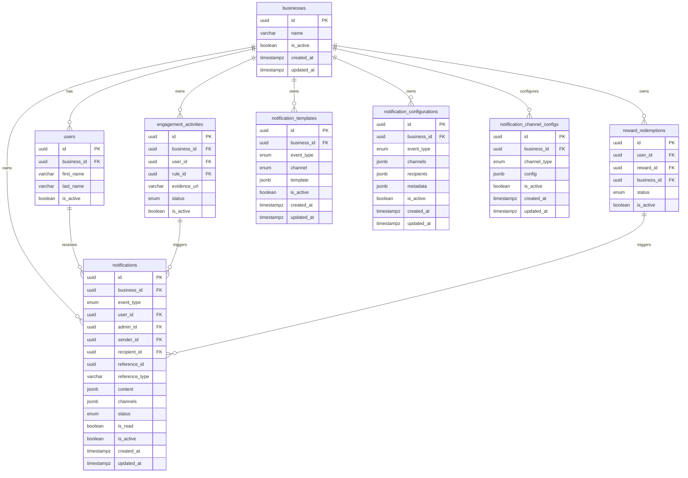
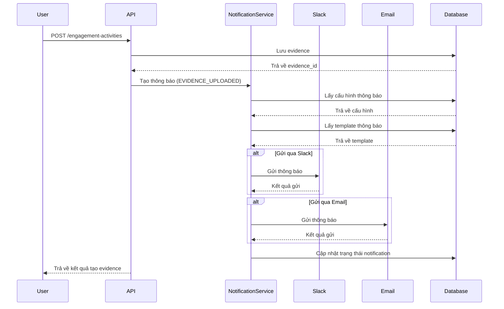

# 🧩 Module: Thông báo (Notifications) - Low-Level Design (LLD)

## 1. Mục tiêu

Xây dựng một hệ thống thông báo linh hoạt và mở rộng được sử dụng trong các trường hợp sau:

- Thông báo khi người dùng tải lên evidence
- Thông báo khi admin phê duyệt/từ chối evidence của người dùng
- Thông báo khi người dùng yêu cầu đổi quà (redeem reward)
- Thông báo khi admin phê duyệt/từ chối yêu cầu đổi quà
- Thông báo khi người dùng tặng điểm cho người dùng khác

Hệ thống này cần hỗ trợ nhiều kênh gửi thông báo kênh Teams và dễ dàng mở rộng thêm các kênh mới (Slack, Email, SMS, Push Notification) trong
tương lai.

## 2. Entities

**notifications**

- `id` (uuid, PK): ID duy nhất của thông báo
- `business_id` (uuid, FK đến `businesses`, not null): Doanh nghiệp liên quan
- `event_type` (enum, not null): Loại sự kiện tạo thông báo
  - `EVIDENCE_UPLOADED`: Người dùng tải lên evidence
  - `EVIDENCE_APPROVED`: Admin phê duyệt evidence
  - `EVIDENCE_REJECTED`: Admin từ chối evidence
  - `REWARD_REQUESTED`: Người dùng yêu cầu đổi quà
  - `REWARD_APPROVED`: Admin phê duyệt yêu cầu đổi quà
  - `REWARD_REJECTED`: Admin từ chối yêu cầu đổi quà
  - `POINTS_TRANSFERRED`: Người dùng tặng điểm cho người dùng khác
- `user_id` (uuid, FK đến `users`, nullable): Người dùng nhận thông báo (có thể là null nếu gửi cho tất cả người dùng)
- `admin_id` (uuid, FK đến `users`, nullable): Admin thực hiện hành động (nếu liên quan)
- `sender_id` (uuid, FK đến `users`, nullable): Người gửi (trong trường hợp chuyển điểm)
- `recipient_id` (uuid, FK đến `users`, nullable): Người nhận (trong trường hợp chuyển điểm)
- `reference_id` (uuid, nullable): ID tham chiếu đến entity liên quan (evidence, reward_redemption)
- `reference_type` (varchar, nullable): Loại entity tham chiếu (engagement_activities, reward_redemptions)
- `content` (jsonb, not null): Nội dung thông báo dạng JSON, bao gồm:
  - `title`: Tiêu đề thông báo
  - `message`: Nội dung thông báo
  - `image_url`: URL hình ảnh (nếu có)
  - `action_url`: URL hành động (nếu có)
  - `metadata`: Thông tin bổ sung
- `channels` (jsonb, not null): Các kênh đã gửi thông báo, bao gồm:
  - `slack`: trạng thái gửi qua Slack
  - `email`: trạng thái gửi qua Email
  - `teams`: trạng thái gửi qua Teams
  - `sms`: trạng thái gửi qua SMS
  - `push`: trạng thái gửi qua Push Notification
- `status` (enum, not null, default: 'pending'): Trạng thái gửi thông báo
  - `pending`: Đang chờ gửi
  - `processing`: Đang xử lý
  - `sent`: Đã gửi
  - `failed`: Gửi thất bại
- `is_read` (boolean, not null, default: false): Đã đọc hay chưa
- `is_active` (boolean, not null, default: true): Hỗ trợ soft delete
- `created_at` (timestampz, not null, default: CURRENT_TIMESTAMP): Thời gian tạo
- `updated_at` (timestampz, nullable): Thời gian cập nhật
- `created_by` (uuid, nullable): Người tạo thông báo
- `updated_by` (uuid, nullable): Người cập nhật thông báo

**notification_templates**

- `id` (uuid, PK): ID duy nhất của template
- `business_id` (uuid, FK đến `businesses`, not null): Doanh nghiệp liên quan
- `event_type` (enum, not null): Loại sự kiện sử dụng template
- `channel` (enum, not null): Kênh gửi thông báo
  - `slack`: Slack
  - `email`: Email
  - `teams`: Microsoft Teams
  - `sms`: SMS
  - `push`: Push Notification
- `template` (jsonb, not null): Nội dung template dạng JSON, bao gồm:
  - `title_template`: Template cho tiêu đề
  - `body_template`: Template cho nội dung
  - `image_template`: Template cho URL hình ảnh (nếu có)
  - `action_template`: Template cho URL hành động (nếu có)
  - `metadata`: Thông tin bổ sung
- `is_active` (boolean, not null, default: true): Trạng thái kích hoạt
- `created_at` (timestampz, not null, default: CURRENT_TIMESTAMP): Thời gian tạo
- `updated_at` (timestampz, nullable): Thời gian cập nhật
- `created_by` (uuid, nullable): Người tạo template
- `updated_by` (uuid, nullable): Người cập nhật template

**notification_configurations**

- `id` (uuid, PK): ID duy nhất của cấu hình
- `business_id` (uuid, FK đến `businesses`, not null): Doanh nghiệp liên quan
- `event_type` (enum, not null): Loại sự kiện
- `channels` (jsonb, not null): Các kênh được bật cho sự kiện này
  - `slack`: boolean
  - `email`: boolean
  - `teams`: boolean
  - `sms`: boolean
  - `push`: boolean
- `recipients` (jsonb, not null): Cấu hình người nhận
  - `all_users`: boolean
  - `specific_users`: array of user_ids
  - `admin_users`: boolean
  - `user_roles`: array of role_ids
- `metadata` (jsonb, nullable): Cấu hình bổ sung
- `is_active` (boolean, not null, default: true): Trạng thái kích hoạt
- `created_at` (timestampz, not null, default: CURRENT_TIMESTAMP): Thời gian tạo
- `updated_at` (timestampz, nullable): Thời gian cập nhật
- `created_by` (uuid, nullable): Người tạo cấu hình
- `updated_by` (uuid, nullable): Người cập nhật cấu hình

**notification_channel_configs**

- `id` (uuid, PK): ID duy nhất của cấu hình kênh
- `business_id` (uuid, FK đến `businesses`, not null): Doanh nghiệp liên quan
- `channel_type` (enum, not null): Loại kênh ('teams', 'slack', 'email', 'sms', 'push')
- `config` (jsonb, not null): Cấu hình kênh dạng JSON, cho Teams bao gồm:
  - `webhook_url`: URL webhook của Teams channel
  - `team_id`: ID của team (optional)
  - `channel_id`: ID của channel (optional)
  - `tenant_id`: ID của tenant (optional)
  - `admin_mention_name`: Tên người dùng nhận mention (@Huy Tran)
- `is_active` (boolean, not null, default: true): Trạng thái kích hoạt
- `created_at` (timestampz, not null, default: CURRENT_TIMESTAMP): Thời gian tạo
- `updated_at` (timestampz, nullable): Thời gian cập nhật

## 2.1 Database Diagram



## 3. Thiết kế Pattern

### 3.1 Factory Pattern

Sử dụng Factory Pattern để tạo ra các đối tượng notification sender phù hợp với từng loại kênh thông báo.

```typescript
// Giao diện chung cho tất cả notification senders
interface NotificationSender {
  send(notification: Notification): Promise<boolean>;
}

// Các implementation cụ thể
class SlackNotificationSender implements NotificationSender {
  async send(notification: Notification): Promise<boolean> {
    // Xử lý gửi thông báo qua Slack
    return true;
  }
}

class EmailNotificationSender implements NotificationSender {
  async send(notification: Notification): Promise<boolean> {
    // Xử lý gửi thông báo qua Email
    return true;
  }
}

class TeamsNotificationSender implements NotificationSender {
  async send(notification: Notification): Promise<boolean> {
    // Xử lý gửi thông báo qua Teams
    return true;
  }
}

class SMSNotificationSender implements NotificationSender {
  async send(notification: Notification): Promise<boolean> {
    // Xử lý gửi thông báo qua SMS
    return true;
  }
}

class PushNotificationSender implements NotificationSender {
  async send(notification: Notification): Promise<boolean> {
    // Xử lý gửi thông báo qua Push Notification
    return true;
  }
}

// Factory class
class NotificationSenderFactory {
  static createSender(channel: string): NotificationSender {
    switch (channel) {
      case 'slack':
        return new SlackNotificationSender();
      case 'email':
        return new EmailNotificationSender();
      case 'teams':
        return new TeamsNotificationSender();
      case 'sms':
        return new SMSNotificationSender();
      case 'push':
        return new PushNotificationSender();
      default:
        throw new Error(`Không hỗ trợ kênh thông báo: ${channel}`);
    }
  }
}
```

### 3.2 Strategy Pattern

Ngoài Factory Pattern, Strategy Pattern cũng là một lựa chọn tốt để xử lý việc gửi thông báo qua nhiều kênh khác nhau.

```typescript
// Giao diện chiến lược gửi thông báo
interface NotificationStrategy {
  send(notification: Notification): Promise<boolean>;
}

// Các chiến lược cụ thể
class SlackStrategy implements NotificationStrategy {
  async send(notification: Notification): Promise<boolean> {
    // Xử lý gửi thông báo qua Slack
    return true;
  }
}

class EmailStrategy implements NotificationStrategy {
  async send(notification: Notification): Promise<boolean> {
    // Xử lý gửi thông báo qua Email
    return true;
  }
}

// Context class sử dụng chiến lược
class NotificationContext {
  private strategy: NotificationStrategy;

  constructor(strategy: NotificationStrategy) {
    this.strategy = strategy;
  }

  setStrategy(strategy: NotificationStrategy): void {
    this.strategy = strategy;
  }

  async sendNotification(notification: Notification): Promise<boolean> {
    return this.strategy.send(notification);
  }
}
```

### 3.3 Observer Pattern

Observer Pattern cũng rất phù hợp cho hệ thống thông báo, cho phép các sự kiện khác nhau kích hoạt thông báo mà không phụ thuộc vào logic xử lý.

```typescript
// Observer interface
interface NotificationObserver {
  update(event: Event): void;
}

// Concrete Observer
class SlackNotificationObserver implements NotificationObserver {
  update(event: Event): void {
    // Gửi thông báo qua Slack
  }
}

class EmailNotificationObserver implements NotificationObserver {
  update(event: Event): void {
    // Gửi thông báo qua Email
  }
}

// Subject
class NotificationSubject {
  private observers: NotificationObserver[] = [];

  registerObserver(observer: NotificationObserver): void {
    this.observers.push(observer);
  }

  unregisterObserver(observer: NotificationObserver): void {
    const index = this.observers.indexOf(observer);
    if (index !== -1) {
      this.observers.splice(index, 1);
    }
  }

  notifyObservers(event: Event): void {
    for (const observer of this.observers) {
      observer.update(event);
    }
  }
}
```

## 4. Use Cases & API Design

### 4.1 Tạo thông báo khi người dùng tải lên minh chứng

**Kích hoạt**: Sau khi API tạo Evidence được gọi thành công

**Trình tự xử lý**:

1. Hệ thống lấy cấu hình thông báo cho sự kiện EVIDENCE_UPLOADED
2. Nếu cấu hình cho phép gửi thông báo, tạo mới notification với trạng thái `pending`
3. Hệ thống lấy template thông báo cho từng kênh
4. Gửi thông báo qua các kênh được cấu hình (Slack, Email, Teams, SMS, Push)
5. Cập nhật trạng thái của notification thành `sent` hoặc `failed`

**Sequence diagram**:



### 4.2 Tạo thông báo khi admin phê duyệt/từ chối minh chứng

**Kích hoạt**: Sau khi API phê duyệt hoặc từ chối evidence được gọi thành công

**Trình tự xử lý**:

1. Hệ thống lấy cấu hình thông báo cho sự kiện EVIDENCE_APPROVED hoặc EVIDENCE_REJECTED
2. Nếu cấu hình cho phép gửi thông báo, tạo mới notification với trạng thái `pending`
3. Hệ thống lấy template thông báo cho từng kênh
4. Gửi thông báo qua các kênh được cấu hình
5. Cập nhật trạng thái của notification thành `sent` hoặc `failed`

### 4.3 Tạo thông báo khi người dùng yêu cầu đổi quà

**Kích hoạt**: Sau khi API tạo Reward Redemption được gọi thành công

**Trình tự xử lý**:

1. Hệ thống lấy cấu hình thông báo cho sự kiện REWARD_REQUESTED
2. Nếu cấu hình cho phép gửi thông báo, tạo mới notification với trạng thái `pending`
3. Hệ thống lấy template thông báo cho từng kênh
4. Gửi thông báo qua các kênh được cấu hình
5. Cập nhật trạng thái của notification thành `sent` hoặc `failed`

### 4.4 Tạo thông báo khi admin phê duyệt/từ chối yêu cầu đổi quà

**Kích hoạt**: Sau khi API phê duyệt hoặc từ chối reward redemption được gọi thành công

**Trình tự xử lý**:

1. Hệ thống lấy cấu hình thông báo cho sự kiện REWARD_APPROVED hoặc REWARD_REJECTED
2. Nếu cấu hình cho phép gửi thông báo, tạo mới notification với trạng thái `pending`
3. Hệ thống lấy template thông báo cho từng kênh
4. Gửi thông báo qua các kênh được cấu hình
5. Cập nhật trạng thái của notification thành `sent` hoặc `failed`

### 4.5 Tạo thông báo khi người dùng tặng điểm cho người dùng khác

**Kích hoạt**: Sau khi API transfer points được gọi thành công

**Trình tự xử lý**:

1. Hệ thống lấy cấu hình thông báo cho sự kiện POINTS_TRANSFERRED
2. Nếu cấu hình cho phép gửi thông báo, tạo mới notification với trạng thái `pending`
3. Hệ thống lấy template thông báo cho từng kênh
4. Gửi thông báo qua các kênh được cấu hình
5. Cập nhật trạng thái của notification thành `sent` hoặc `failed`

## 5. Chi tiết format nội dung thông báo

### 5.1 Khi end user upload evidence

**Tiêu đề**: Có bằng chứng mới

**Nội dung**:

```
[dd/mm/yyyy hh:mm AM/PM]
[end-user name] vừa tải lên bằng chứng mới là [rule name]
@Huy Tran
<evidence image>
<button: View>
```

**Ví dụ**:

```
Có bằng chứng mới
7/5/2025 1:35PM
Linh Pham vừa tải lên bằng chứng mới là Rửa chén
<button: View list>
```

### 5.2 Khi admin phê duyệt evidence

**Tiêu đề**: Phê duyệt bằng chứng ✅

**Nội dung**:

```
[dd/mm/yyyy hh:mm AM/PM]
[end-user name] nhận [points] điểm từ [rule name]
<evidence image>
```

**Ví dụ**:

```
Phê duyệt bằng chứng ✅
7/5/2025 1:35PM
Linh Pham nhận 2 điểm từ Rửa chén
```

### 5.3 Khi admin từ chối evidence

**Tiêu đề**: Từ chối bằng chứng

**Nội dung**:

```
[dd/mm/yyyy hh:mm AM/PM]
[Admin User] từ chối bằng chứng [rule name] của [end user name] vì [reason]
<evidence image>
```

**Ví dụ**:

```
Từ chối bằng chứng
7/5/2025 1:35PM
Admin User từ chối bằng chứng Rửa chén của Linh Pham vì ảnh mờ quá
```

### 5.4 Khi user yêu cầu đổi quà

**Tiêu đề**: Có yêu cầu đổi quà mới

**Nội dung**:

```
[dd/mm/yyyy hh:mm AM/PM]
[end-user name] vừa mới yêu cầu đổi [reward name]
@Huy Tran
<reward image>
<button: View >
```

**Ví dụ**:

```
Có yêu cầu đổi quà mới
7/5/2025 1:35PM
Linh Pham vừa yêu cầu đổi Milo
<button: View >
```

### 5.5 Khi admin phê duyệt yêu cầu đổi quà

**Tiêu đề**: Phê duyệt yêu cầu đổi quà 🎉

**Nội dung**:

```
[dd/mm/yyyy hh:mm AM/PM]
[end-user name] sử dụng [points] điểm để đổi [reward name] thành công!🎉
<reward image>
```

**Ví dụ**:

```
Phê duyệt yêu cầu đổi quà 🎉
7/5/2025 1:35PM
Linh Pham sử dụng 2 điểm để đổi Milo thành công!🎉
```

### 5.6 Khi admin từ chối yêu cầu đổi quà

**Tiêu đề**: Từ chối yêu cầu đổi quà

**Nội dung**:

```
[dd/mm/yyyy hh:mm AM/PM]
[Admin User] từ chối yêu cầu đổi quà [reward name] của [end user name]
<reward image>
```

**Ví dụ**:

```
Từ chối yêu cầu đổi quà
7/5/2025 1:35PM
[Admin User] từ chối yêu cầu đổi quà Milo của Linh Pham
```

### 5.7 Khi user tặng điểm cho user khác

**Tiêu đề**: Thông báo húp điểm

**Nội dung**:

```
[dd/mm/yyyy hh:mm AM/PM]
[giver] vừa tặng [give away points] điểm cho [recipient] với nội dung [description]
```

**Ví dụ**:

```
Thông báo húp điểm
7/5/2025 1:35PM
Linh Pham vừa tặng 10 điểm cho Thien Lam với nội dung Tặng Thiện 10 điểm nhó
```

## 6. Đề xuất cải tiến

### 6.1 Ứng dụng Template Method Pattern

Ngoài Factory Pattern, Template Method Pattern cũng có thể được áp dụng để xử lý quy trình gửi thông báo với các bước cụ thể, trong khi vẫn cho phép
các lớp con tùy chỉnh cách thức gửi thông báo.

```typescript
// Abstract class định nghĩa template method
abstract class NotificationSender {
  // Template method
  async sendNotification(notification: Notification): Promise<boolean> {
    // Các bước chung
    this.prepareContent(notification);
    const result = await this.send(notification);
    this.logResult(notification, result);
    return result;
  }

  // Các phương thức có thể ghi đè
  protected prepareContent(notification: Notification): void {
    // Xử lý chung, có thể ghi đè
  }

  // Phương thức trừu tượng bắt buộc implement
  protected abstract send(notification: Notification): Promise<boolean>;

  // Phương thức hook
  protected logResult(notification: Notification, result: boolean): void {
    console.log(`Notification ${notification.id} sent: ${result}`);
  }
}

// Các class cụ thể
class SlackNotificationSender extends NotificationSender {
  protected async send(notification: Notification): Promise<boolean> {
    // Xử lý gửi qua Slack
    return true;
  }
}

class EmailNotificationSender extends NotificationSender {
  protected prepareContent(notification: Notification): void {
    // Xử lý đặc biệt cho email
    super.prepareContent(notification);
  }

  protected async send(notification: Notification): Promise<boolean> {
    // Xử lý gửi qua Email
    return true;
  }
}
```

### 6.2 Ứng dụng Queue System

Đề xuất sử dụng hệ thống queue cho việc gửi thông báo để tăng hiệu suất và độ tin cậy:

1. Khi một sự kiện xảy ra, thay vì gửi thông báo trực tiếp, hệ thống sẽ đẩy một message vào queue
2. Các worker process sẽ xử lý các message trong queue và gửi thông báo
3. Nếu gửi thất bại, message có thể được đưa vào dead-letter queue để xử lý lại sau

Mô hình này giúp:

- Giảm thời gian phản hồi API
- Xử lý được số lượng lớn thông báo
- Dễ dàng retry khi gặp lỗi
- Theo dõi và debug quá trình gửi thông báo

### 6.3 Ứng dụng Decorator Pattern

Decorator Pattern có thể được sử dụng để thêm các tính năng phụ cho việc gửi thông báo như caching, logging, retry logic, throttling:

```typescript
// Component interface
interface NotificationSender {
  send(notification: Notification): Promise<boolean>;
}

// Concrete Component
class BasicNotificationSender implements NotificationSender {
  async send(notification: Notification): Promise<boolean> {
    // Gửi thông báo cơ bản
    return true;
  }
}

// Base Decorator
abstract class NotificationSenderDecorator implements NotificationSender {
  constructor(protected wrappee: NotificationSender) {}

  async send(notification: Notification): Promise<boolean> {
    return this.wrappee.send(notification);
  }
}

// Concrete Decorators
class LoggingDecorator extends NotificationSenderDecorator {
  async send(notification: Notification): Promise<boolean> {
    console.log(`Sending notification: ${notification.id}`);
    const result = await super.send(notification);
    console.log(`Notification ${notification.id} sent: ${result}`);
    return result;
  }
}

class RetryDecorator extends NotificationSenderDecorator {
  constructor(
    wrappee: NotificationSender,
    private maxRetries: number = 3,
  ) {
    super(wrappee);
  }

  async send(notification: Notification): Promise<boolean> {
    let attempts = 0;
    let result = false;

    while (attempts < this.maxRetries && !result) {
      attempts++;
      try {
        result = await super.send(notification);
      } catch (error) {
        if (attempts >= this.maxRetries) {
          throw error;
        }
        // Delay before retry
        await new Promise(resolve => setTimeout(resolve, 1000 * attempts));
      }
    }

    return result;
  }
}
```

## 7. Kết luận

Hệ thống thông báo được thiết kế với các pattern tiên tiến giúp:

1. **Linh hoạt**: Hỗ trợ nhiều kênh thông báo khác nhau
2. **Mở rộng**: Dễ dàng thêm kênh thông báo mới hoặc loại sự kiện mới
3. **Bảo trì**: Sử dụng Factory Pattern giúp code dễ bảo trì
4. **Cấu hình**: Hỗ trợ template và cấu hình tùy chỉnh cho từng loại thông báo
5. **Hiệu suất**: Có thể tích hợp với hệ thống queue để xử lý số lượng lớn thông báo

Factory Pattern là lựa chọn chính cho hệ thống này, nhưng Strategy Pattern và Observer Pattern cũng là những lựa chọn tốt tùy thuộc vào yêu cầu cụ thể
và môi trường phát triển.

## 8. Chi tiết triển khai cho Microsoft Teams

### 8.1 Microsoft Teams Webhook Configuration

**notification_channel_configs**

- `id` (uuid, PK): ID duy nhất của cấu hình kênh
- `business_id` (uuid, FK đến `businesses`, not null): Doanh nghiệp liên quan
- `channel_type` (enum, not null): Loại kênh ('teams', 'slack', 'email', 'sms', 'push')
- `config` (jsonb, not null): Cấu hình kênh dạng JSON, cho Teams bao gồm:
  - `webhook_url`: URL webhook của Teams channel
  - `team_id`: ID của team (optional)
  - `channel_id`: ID của channel (optional)
  - `tenant_id`: ID của tenant (optional)
  - `admin_mention_name`: Tên người dùng nhận mention (@Huy Tran)
- `is_active` (boolean, not null, default: true): Trạng thái kích hoạt
- `created_at` (timestampz, not null, default: CURRENT_TIMESTAMP): Thời gian tạo
- `updated_at` (timestampz, nullable): Thời gian cập nhật

### 8.2 Teams-specific Message Templates

Microsoft Teams hỗ trợ Adaptive Cards và MessageCard formats, cho phép tạo thông báo với hình ảnh và các tùy chọn tương tác. Dưới đây là ví dụ về cấu
trúc MessageCard:

```json
{
  "@type": "MessageCard",
  "@context": "http://schema.org/extensions",
  "themeColor": "0076D7",
  "summary": "Có bằng chứng mới",
  "sections": [
    {
      "activityTitle": "Có bằng chứng mới",
      "activitySubtitle": "07/05/2025 1:35PM",
      "activityImage": "https://evidence-url.jpg",
      "facts": [
        {
          "name": "User:",
          "value": "Linh Pham"
        },
        {
          "name": "Rule:",
          "value": "Rửa chén"
        }
      ],
      "markdown": true
    }
  ],
  "potentialAction": [
    {
      "@type": "OpenUri",
      "name": "View",
      "targets": [
        {
          "os": "default",
          "uri": "https://example.com/evidence/123"
        }
      ]
    }
  ]
}
```

### 8.3 Triển khai TeamsNotificationSender

```typescript
interface TeamsMessageOptions {
  title: string;
  subtitle: string;
  text: string;
  imageUrl?: string;
  buttonText?: string;
  buttonUrl?: string;
  themeColor?: string;
  mentions?: Array<{
    id: string;
    name: string;
  }>;
}

class TeamsNotificationSender implements NotificationSender {
  private webhookUrl: string;

  constructor(webhookUrl: string) {
    this.webhookUrl = webhookUrl;
  }

  async send(notification: Notification): Promise<boolean> {
    try {
      const templateData = this.prepareTemplateData(notification);
      const messageCard = this.buildMessageCard(templateData);

      const response = await fetch(this.webhookUrl, {
        method: 'POST',
        headers: {
          'Content-Type': 'application/json',
        },
        body: JSON.stringify(messageCard),
      });

      if (!response.ok) {
        throw new Error(`Teams API responded with ${response.status}: ${response.statusText}`);
      }

      return true;
    } catch (error) {
      console.error('Failed to send Teams notification:', error);
      return false;
    }
  }

  private prepareTemplateData(notification: Notification): TeamsMessageOptions {
    const { content, event_type } = notification;
    let title = content.title;
    let subtitle = this.formatDateTime(notification.created_at);
    let text = content.message;
    let imageUrl = content.image_url;
    let buttonText = 'View';
    let buttonUrl = content.action_url;
    let themeColor = this.getThemeColorByEventType(event_type);
    let mentions = [];

    // Nếu có cấu hình mention
    if (notification.event_type === 'EVIDENCE_UPLOADED' || notification.event_type === 'REWARD_REQUESTED') {
      // Lấy thông tin người dùng cần mention từ cấu hình
      mentions.push({
        id: 'admin-id', // Lấy từ cấu hình
        name: 'Huy Tran', // Lấy từ cấu hình
      });
    }

    return {
      title,
      subtitle,
      text,
      imageUrl,
      buttonText,
      buttonUrl,
      themeColor,
      mentions,
    };
  }

  private buildMessageCard(options: TeamsMessageOptions): any {
    // Tạo MessageCard với mentions nếu cần
    const messageCard = {
      '@type': 'MessageCard',
      '@context': 'http://schema.org/extensions',
      themeColor: options.themeColor || '0076D7',
      summary: options.title,
      sections: [
        {
          activityTitle: options.title,
          activitySubtitle: options.subtitle,
          text: options.text,
          markdown: true,
        },
      ],
    };

    // Thêm hình ảnh nếu có
    if (options.imageUrl) {
      messageCard.sections[0].activityImage = options.imageUrl;
    }

    // Thêm button nếu có
    if (options.buttonText && options.buttonUrl) {
      messageCard.potentialAction = [
        {
          '@type': 'OpenUri',
          name: options.buttonText,
          targets: [
            {
              os: 'default',
              uri: options.buttonUrl,
            },
          ],
        },
      ];
    }

    // Thêm mentions nếu có
    if (options.mentions && options.mentions.length > 0) {
      messageCard.sections[0].text += this.formatMentions(options.mentions);
    }

    return messageCard;
  }

  private formatDateTime(dateTime: Date | string): string {
    const date = new Date(dateTime);
    return date.toLocaleString('vi-VN', {
      day: '2-digit',
      month: '2-digit',
      year: 'numeric',
      hour: '2-digit',
      minute: '2-digit',
      hour12: true,
    });
  }

  private getThemeColorByEventType(eventType: string): string {
    switch (eventType) {
      case 'EVIDENCE_UPLOADED':
        return '0078D7'; // blue
      case 'EVIDENCE_APPROVED':
        return '2D7D4B'; // green
      case 'EVIDENCE_REJECTED':
        return 'D13438'; // red
      case 'REWARD_REQUESTED':
        return 'A866E2'; // purple
      case 'REWARD_APPROVED':
        return '2D7D4B'; // green
      case 'REWARD_REJECTED':
        return 'D13438'; // red
      case 'POINTS_TRANSFERRED':
        return 'F7AD18'; // yellow
      default:
        return '0076D7'; // default blue
    }
  }

  private formatMentions(mentions: Array<{ id: string; name: string }>): string {
    let mentionText = '\n\n';
    mentions.forEach(mention => {
      mentionText += `<at>${mention.name}</at> `;
    });
    return mentionText;
  }
}
```

### 8.4 Hướng dẫn triển khai step-by-step

1. **Tạo Incoming Webhook trong Microsoft Teams**:

   - Mở Microsoft Teams và chọn team/channel sẽ nhận thông báo
   - Click vào "..." bên cạnh tên channel -> "Connectors"
   - Tìm "Incoming Webhook" -> "Add" -> "Configure"
   - Đặt tên "ABC Rewards Notifications", tải lên logo (nếu có) -> "Create"
   - Copy webhook URL được tạo ra

2. **Lưu trữ cấu hình Webhook**:

   - Tạo bảng `notification_channel_configs` trong database
   - Thêm record cho Teams webhook với URL đã lấy được
   - Cập nhật môi trường với biến `TEAMS_WEBHOOK_URL`

3. **Triển khai TeamsNotificationSender**:

   - Tạo file `src/services/notifications/senders/teams-notification-sender.ts`
   - Triển khai class TeamsNotificationSender theo code mẫu ở trên
   - Cập nhật NotificationSenderFactory để tạo đối tượng TeamsNotificationSender

4. **Cập nhật template cho Teams**:

   - Tạo template cho từng loại thông báo trong bảng `notification_templates` với `channel` = 'teams'
   - Đảm bảo template bao gồm các placeholder cho tiêu đề, nội dung, ảnh, URL hành động

5. **Xử lý ảnh trong thông báo**:

   - Khi gửi thông báo, cần đảm bảo URL ảnh (evidence_url, reward_image_url) phải là URL công khai
   - Nếu hình ảnh được lưu trữ riêng tư, cần tạo signed URL hoặc pre-signed URL (với S3)
   - Thêm URL ảnh vào thuộc tính `activityImage` của MessageCard

6. **Xử lý mentions trong thông báo**:

   - Microsoft Teams hỗ trợ mentions qua tag `<at>Username</at>` trong phần nội dung
   - Lưu tên người dùng (admin) cần được mention trong cấu hình
   - Thêm mentions vào thông báo khi cần (EVIDENCE_UPLOADED, REWARD_REQUESTED)

7. **Xử lý các action button**:

   - Thêm URL action (xem chi tiết) vào `potentialAction` của MessageCard
   - URL này nên dẫn đến trang chi tiết evidence hoặc reward trong ứng dụng web

8. **Kiểm thử**:
   - Tạo test case cho từng loại thông báo
   - Gửi thông báo test đến webhook đã tạo
   - Kiểm tra xem thông báo có hiển thị đúng trên Teams không (bao gồm ảnh, mentions, buttons)

### 8.5 Điều chỉnh format thông báo cho Teams

Teams MessageCard hỗ trợ nhiều tính năng hiển thị phong phú. Mỗi loại thông báo được format như sau:

#### 8.5.1 Thông báo khi user upload evidence

```json
{
  "@type": "MessageCard",
  "@context": "http://schema.org/extensions",
  "themeColor": "0078D7",
  "summary": "Có bằng chứng mới",
  "sections": [
    {
      "activityTitle": "Có bằng chứng mới",
      "activitySubtitle": "07/05/2025 1:35PM",
      "facts": [
        {
          "name": "User:",
          "value": "Linh Pham"
        },
        {
          "name": "Rule:",
          "value": "Rửa chén"
        }
      ],
      "images": [
        {
          "image": "https://example.com/evidence/123.jpg",
          "title": "Evidence Image"
        }
      ],
      "text": "<at>Huy Tran</at>",
      "markdown": true
    }
  ],
  "potentialAction": [
    {
      "@type": "OpenUri",
      "name": "View",
      "targets": [
        {
          "os": "default",
          "uri": "https://example.com/evidence/123"
        }
      ]
    }
  ]
}
```

#### 8.5.2 Xác nhận khả năng của Teams

1. **Chèn ảnh trong thông báo**: Teams **hỗ trợ đầy đủ** việc hiển thị hình ảnh trong thông báo thông qua thuộc tính `images` trong section hoặc
   `activityImage`. Ảnh phải được lưu trữ ở URL công khai có thể truy cập được.

2. **Tag người dùng (mentions)**: Teams **hỗ trợ mentions** thông qua cú pháp `<at>Username</at>` trong nội dung thông báo. Tuy nhiên, để mention hoạt
   động đúng với ID người dùng, bạn cần sử dụng Graph API với nhiều quyền hơn. Với webhook đơn giản, tag sẽ hiển thị nhưng không gửi thông báo đến
   người dùng.

### 8.6 Các lưu ý khi triển khai

1. **Bảo mật Webhook URL**: URL webhook là bí mật và cho phép gửi thông báo đến channel. Cần lưu trữ an toàn như một secret.

2. **Rate limiting**: Teams có giới hạn tốc độ gửi thông báo (khoảng 50-100 requests/phút). Nên triển khai hệ thống queue để tránh vượt quá giới hạn.

3. **Kích thước thông báo**: Teams có giới hạn kích thước cho mỗi thông báo (≈ 28KB). Tránh gửi nội dung quá lớn.

4. **Xử lý lỗi**: Webhook có thể tạm thời không khả dụng. Nên triển khai logic retry với exponential backoff.

5. **Monitoring**: Theo dõi tỉ lệ gửi thành công/thất bại để phát hiện vấn đề với kênh Teams.
